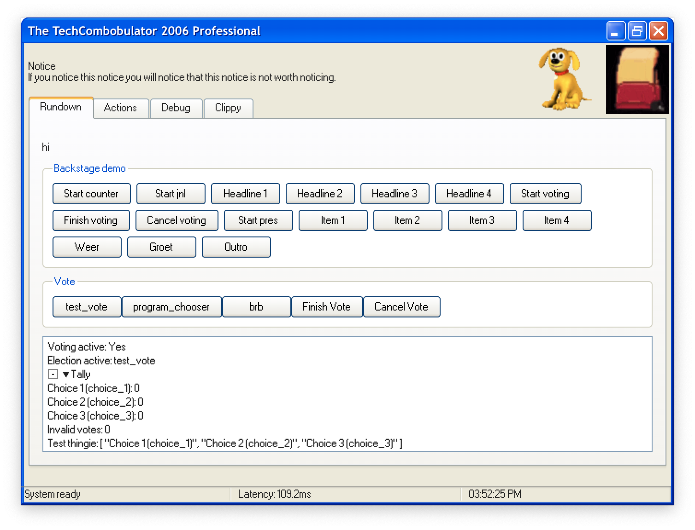
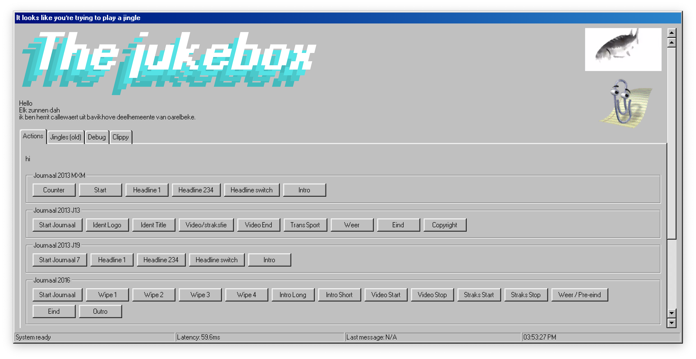
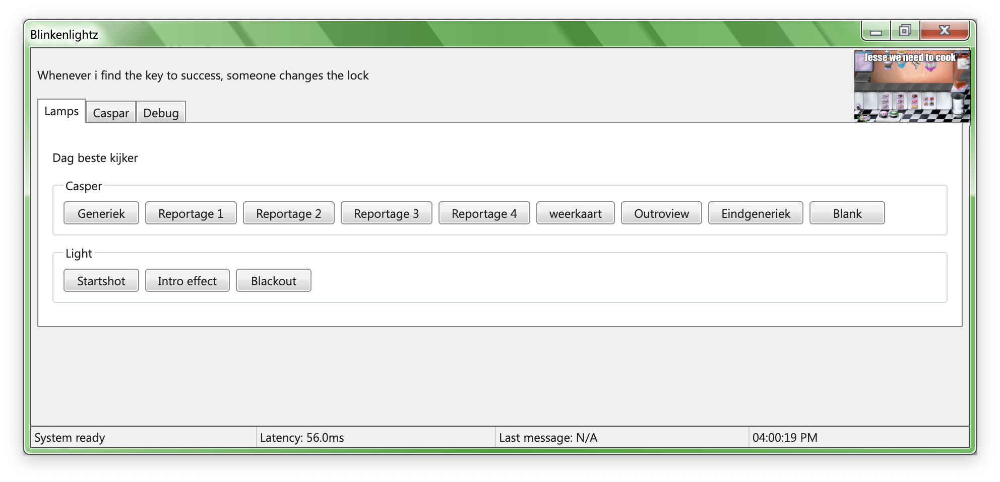
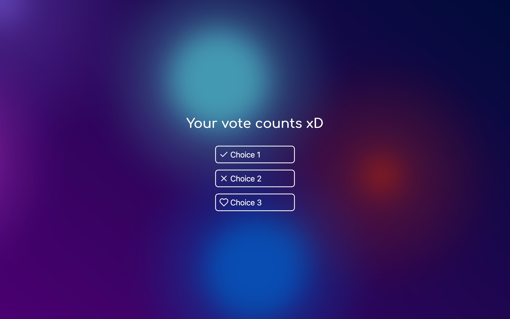
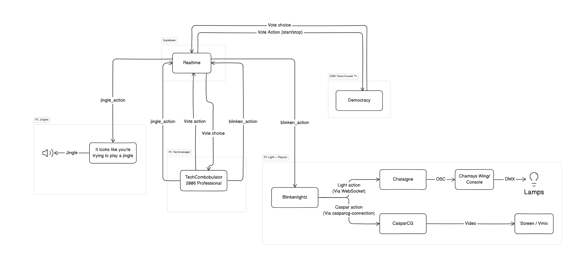

## Backstage

Backstage is a suite of programs that allow you to integrate interactivity and automation in your live performacne.

It consists of the following programs:

### TechCombobulator 2006 Professional

_Also known as Orchestrator, but we use a funny name_

This program is the main interface for the technician. It controls all the other programs, and counts votes.

### It looks like you're trying to play a jingle

_Also sometimes known as Jukebox_
It plays your jingles.

It can play, stop, fade in and fade out jingles depending on the action taken.

### Blinkenlightz

This is a connection program between Chataigne for Chamsys, and CasparCG to control media playback.

### Democracy

A web app for users to vote. Very simple, it receives all vote data from TechCombobulator. This way future features could be implemented to create live votes, though this has not been implemented yet.

### General

Below is a block diagram:

At this point everything is a bit bare, but it's all free and open source. Feel free to fork, improve, and ask for help. I'd love for this to be used in an actual production!

Repositories:

- TechCombobulator: [https://github.com/MaxTechnics/TechCombobulator-2006-Professional](https://github.com/MaxTechnics/TechCombobulator-2006-Professional)
- It looks like you’re trying to play a jingle: [https://github.com/MaxTechnics/it-looks-like-youre-trying-to-play-a-jingle](https://github.com/MaxTechnics/it-looks-like-youre-trying-to-play-a-jingle)
- Blinkenlightz: [https://github.com/MaxTechnics/blinkenlightz](https://github.com/MaxTechnics/blinkenlightz)
- Democracy: [https://github.com/MaxTechnics/democracy](https://github.com/MaxTechnics/democracy)
