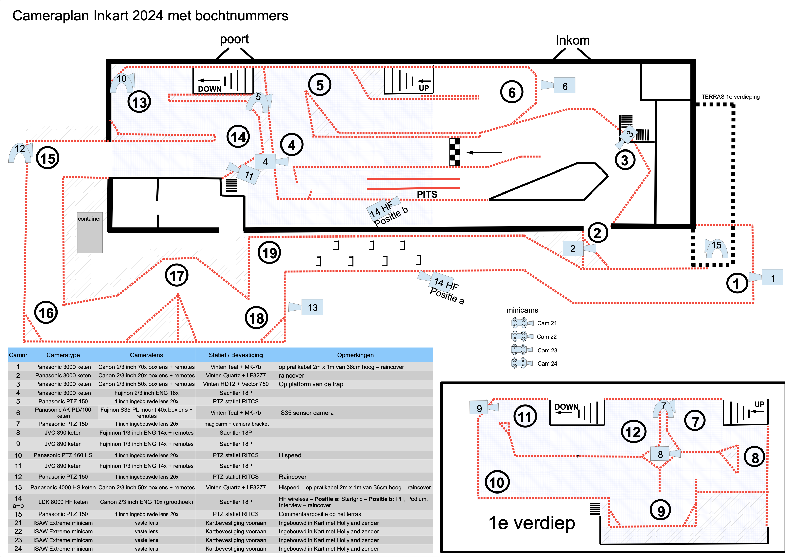
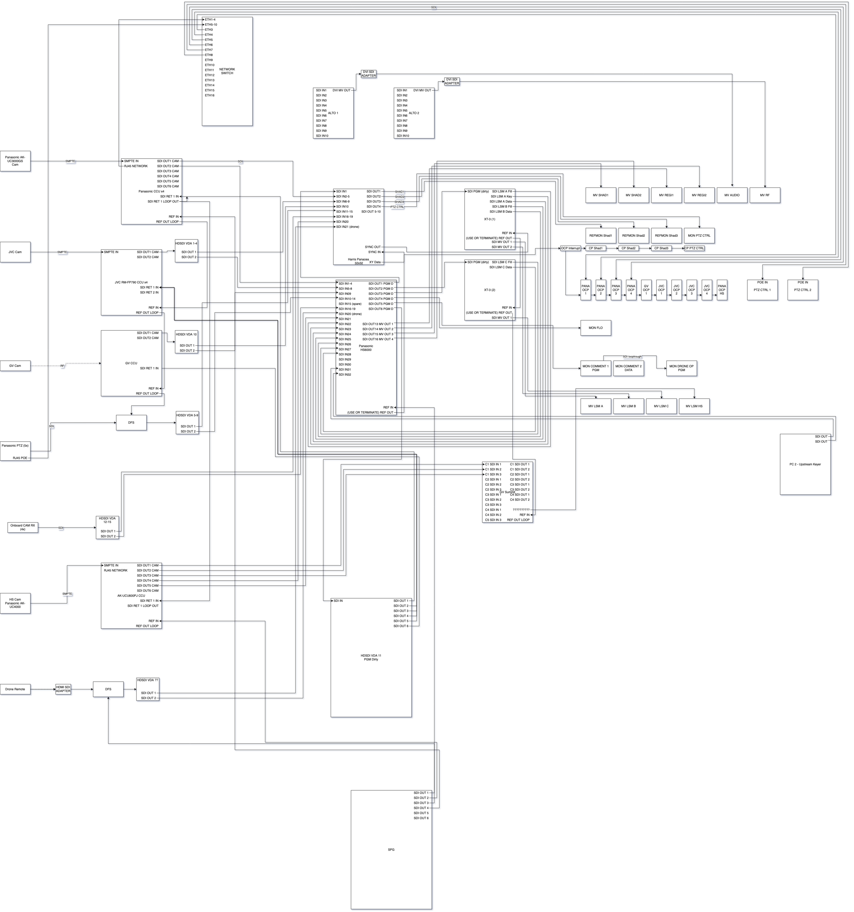

## Inkart

The Inkart project is the biggest project I've worked on so far. It was assigned to all students following the Audiovisual Technology trajectory.

It was split into 6 clusters:

- Audio: Responsible for all audio signals, and mics
- HF: Responsible for all wireless connections, including wireless camera's
- LSM: Responsible for working with the 3 EVS LSM channels
- Data: Responsible for the live stream, as well as the live data overlays
- Videomix: Responsible for setting up and operating the video mixer itself
- Video: Responsible for all video signals.

The race track has an upper and lower level, as well as a section outside. Coverage for the entire track was ensured using 19 cameras, a mix of on-board, PTZ, operated and wireless cameras.

It would be recorded, broadcast live on Eclips TV, and live streamed to YouTube.

### So what did I do?

As cluster video you really are the part that joins the other clusters, since many signals need to go from one cluster to another, trough the video cluster of course.

It was important to keep tabs on who gives what signals, and who needs what signals.

On location I personally wired all the racks together, which became really hard as I didn't have enough short patch cables, requiring me to use up to 15m cables for connections that should've been done with 50cm cables at max.
It. Was. Horrible...

### Syncing

For reference clocking we used BlackBurst. However the wireless board camera's and the PTZ cameras did not get sync.

We used 2 toolracks, 1 was filled with VDA's (and god did we need them) and 1 SPG, the other had a combination of VDA's and frame stores, which we used to sync up the camera's before they went to the video mixer and any recording device.

The mess of wires above also made it really hard to find one of the sync issues we had, which turned out to be a broken cable, however it was nearly impossible to navigate it.

### Images

Below is a block diagram of the entire video cluster. It can be overwhelming though :c

Here's one of our test setups.

If you want the full technical breakdown, I've been granted permission to share the technical report I made (in Dutch), it's available [here](/Technisch_verslag_Inkart_MaximCoppieters.pdf)

The live stream is still available on YouTube: [https://www.youtube.com/watch?v=DzFBJLkM_L8](https://www.youtube.com/watch?v=DzFBJLkM_L8)
