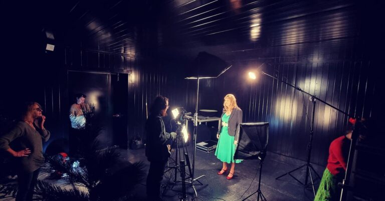

## INSCENE

INSCENE is a small company based in Sint-Truiden. It does anything technical related to event, theatre and general photo and video.

## Internship

As an intern, I got a lot of hands-on experience as well as learning moments with many tools, audio, video, rigging and more. It was a lot of fun, and a great place to learn anything!

I also got to film some stuff, which was fun:

