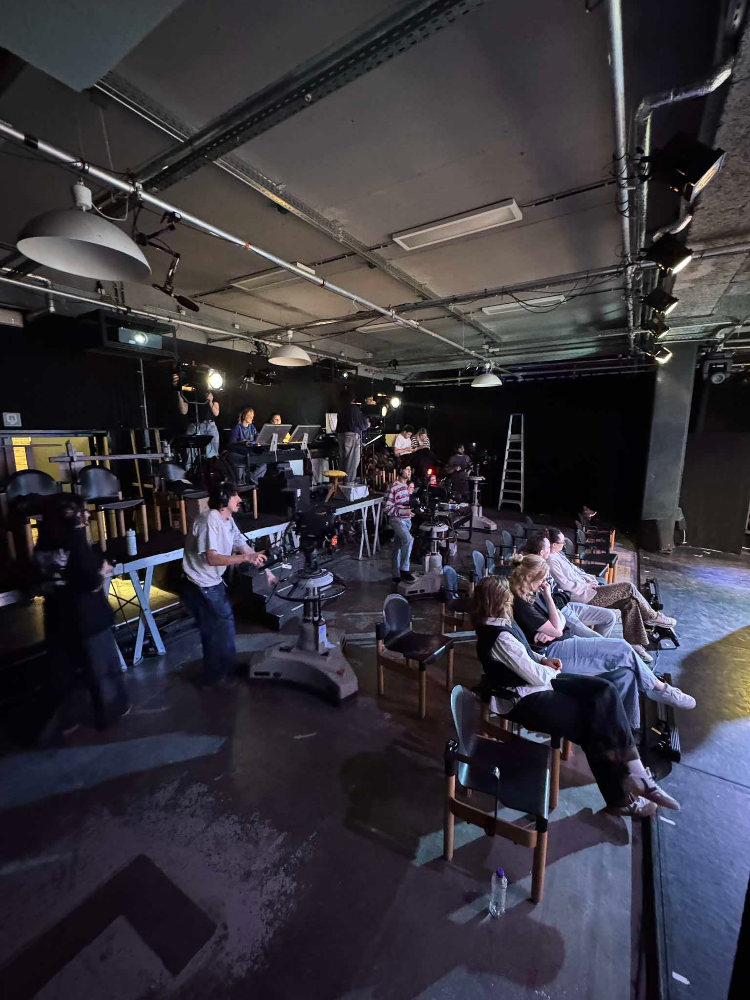

## Nine to Five

One of our assignments was being project lead for once. I was assigned Musical, together with a co-student.
It consisted of a few things:

- Recording of one of the shows
- Live streaming said show
- Being responsible for the PA for all shows
- Assisting in video mapping

### Projection

One of the students, Dries Vandormael, designed all projection and visuals for the live stream.

### PA

Robin Cooremans and Wout Temmerman did the PA for all the shows

### Recording

I was technical head on this project. The recording was done using 4 cameras: 3 operated ones, and one global shot.

We used the base RITCS mobile studio which consists of 3 Panasonic AK-UC3000 camera bodies, with CCU and ROP. For the global shot we used a JVC GY-HM790.

We recorded Program and 3 ISO's. One of which being the global shot as safety.
Live streaming happened over Vimeo, using OBS.

This is how our makeshift TV-room looked:

(Faces hidden as I do not have permission to publish them.)

Luckily the wall did not go all the way up, which allowed us to have all cables go over them, so the room itself could be locked during the night.

All in all, it was a really fun project, and I enjoyed doing the technical work.
