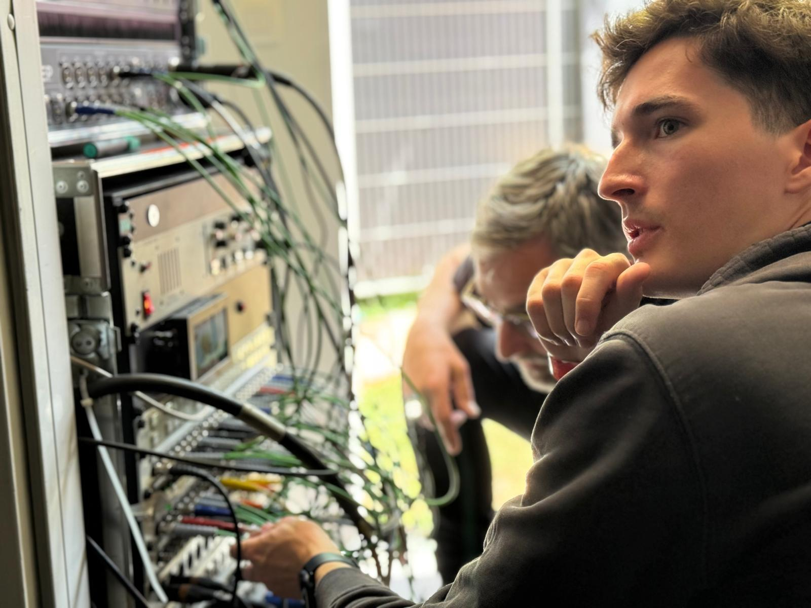

This was my last multicam project as a student at the RITCS.  
I assisted in the buildup and connection of the video, but did not do the planning or reservation of materials.

Just like many of the multicam projects, the base was the RITCS' mobile studio. This time combined with their PTZ set, and PTZ cameras provided by the special olympics themselves.

The biggest challenges were power outages we experienced, making testing everything quite a challenge.

It was a fun project to be part of, and I learned, just as with every other project.
