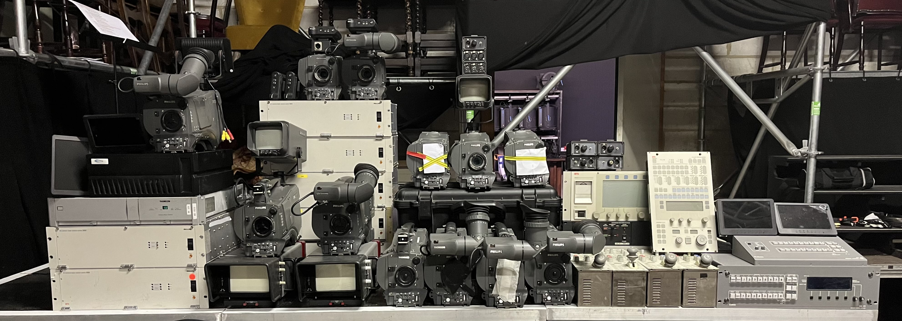

## So I got 12 Grass Valleys, now what?

I love old technology, and when I heard all this was going to be thrown out, I almost cried. So I took it all home. But what to do with it?

Well I don't have triax cable, so I can't really use them with their CCU's (yet, if you happen to throw out old stuff, or triax, please reach out!)

My dream would be to create a small multicam setup with them, and record some fun stuff.

Right now I use them for small recording projects. Although they are SD, their optical quality is surprisingly good.

I'm possibly getting my hands on a deinterlacer soon, which would make these camera's quite usable today.
No they're not going to be the next big thing. But it'd be such a shame if they just were to be thrown out. I've learned a lot by just reading their manuals, and messing around with them. Besides, I never thought I'd ever have a studio camera for myself at home.

Old junk is awesome, and you can learn more from it than you might think.

To be continued...
